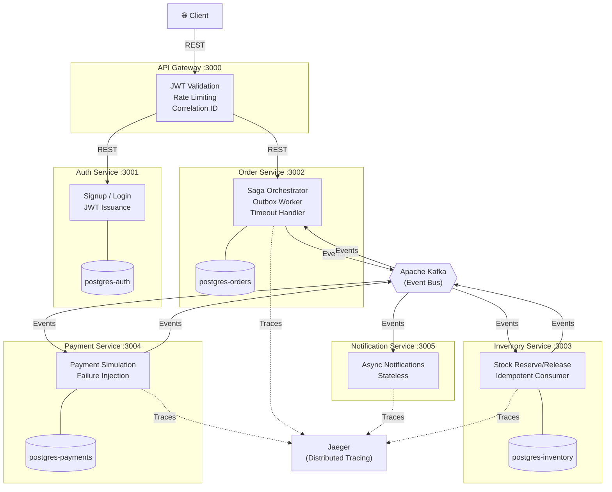
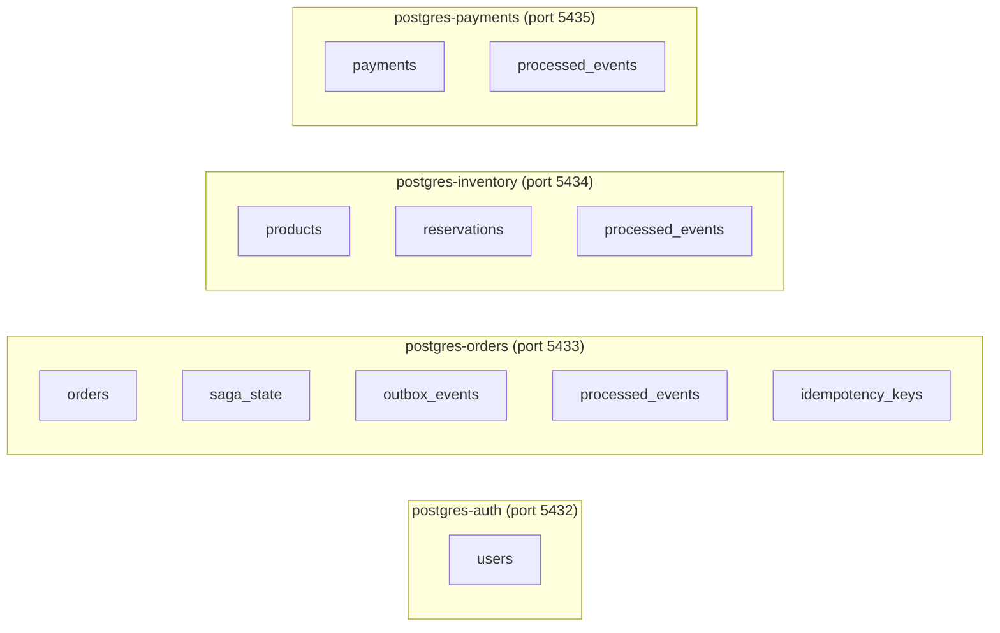
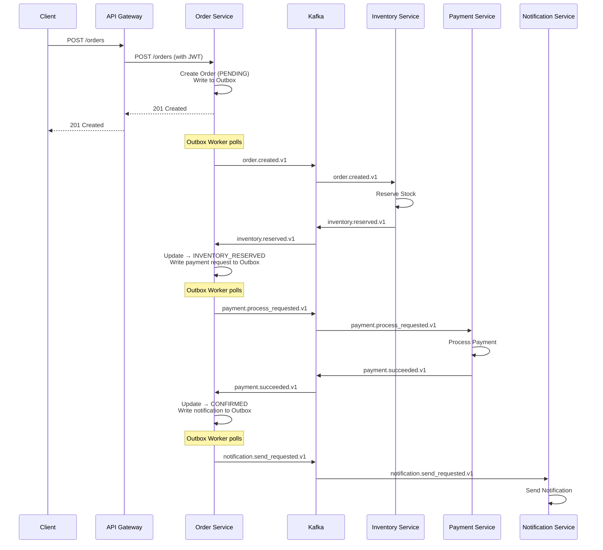

# Eventify — System Architecture

## Overview

Eventify is an event-driven microservices system that processes orders through a **Saga orchestration pattern**. The system coordinates inventory reservation, payment processing, and notifications — all communicated asynchronously via Apache Kafka.

---

## High-Level Architecture



---

## Service Communication

| From | To | Method | Description |
|------|----|--------|-------------|
| Client | API Gateway | REST | All external requests |
| API Gateway | Auth Service | REST (proxy) | Signup, Login |
| API Gateway | Order Service | REST (proxy) | Create/Get orders |
| Order Service | Kafka | Event publish | Via Transactional Outbox |
| Kafka | Inventory Service | Event consume | `order.created.v1` |
| Kafka | Payment Service | Event consume | `payment.process_requested.v1` |
| Kafka | Notification Service | Event consume | `order.confirmed.v1`, `order.failed.v1` |
| Inventory Service | Kafka | Event publish | `inventory.reserved.v1`, `inventory.failed.v1` |
| Payment Service | Kafka | Event publish | `payment.succeeded.v1`, `payment.failed.v1` |
| Kafka | Order Service | Event consume | All response events |

### Key Principle
> **No synchronous service-to-service calls.** All inter-service communication happens via Kafka events. The only REST calls are from the API Gateway to internal service APIs.

---

## Database Isolation

Each service owns its database completely. No cross-service DB access.



---

## Event Flow (Happy Path)



---

## Reliability Patterns

### 1. Transactional Outbox
Solves the **dual-write problem**: business state and events are written in the same DB transaction. An async worker then publishes events to Kafka.

```
┌─────────────────────────────────┐
│     Single DB Transaction       │
│                                 │
│  1. UPDATE orders SET status =  │
│     'INVENTORY_RESERVED'        │
│                                 │
│  2. INSERT INTO outbox_events   │
│     (payment.process_requested) │
│                                 │
└─────────────────────────────────┘
         ↓ (async)
   Outbox Worker publishes to Kafka
```

### 2. Idempotent Consumers
Every consumer checks `processed_events` table before processing. If `event_id` exists, skip.

### 3. Dead Letter Queue (DLQ)
Messages that fail after max retries are sent to `*.dlq` topics for manual review.

### 4. Saga Timeout
Background job detects stale `PAYMENT_PENDING` sagas and triggers compensation.

---

## Observability Stack

| Tool | URL | Purpose |
|------|-----|---------|
| Jaeger | `http://localhost:16686` | Distributed trace visualization |
| Kafka UI | `http://localhost:8080` | Topic/message inspection |
| Structured Logs | Docker logs | JSON logs with correlation IDs |

---

## Tech Stack

| Component | Technology |
|-----------|-----------|
| Runtime | Node.js + TypeScript |
| Framework | Express.js |
| ORM | Prisma |
| Message Broker | Apache Kafka |
| Database | PostgreSQL (per service) |
| Tracing | OpenTelemetry + Jaeger |
| Auth | JWT + bcrypt |
| Containerization | Docker Compose |
