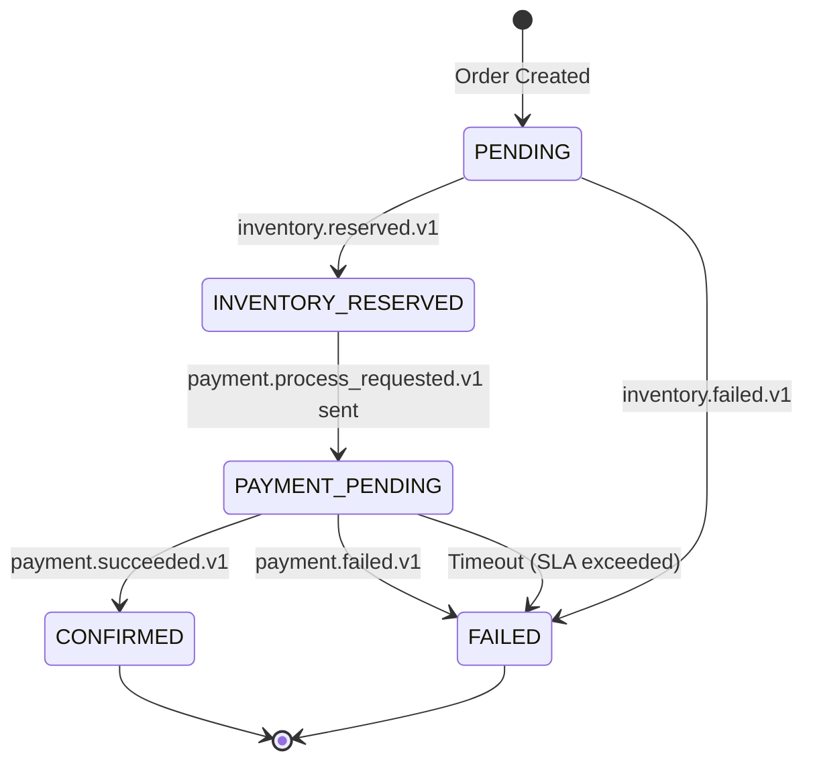
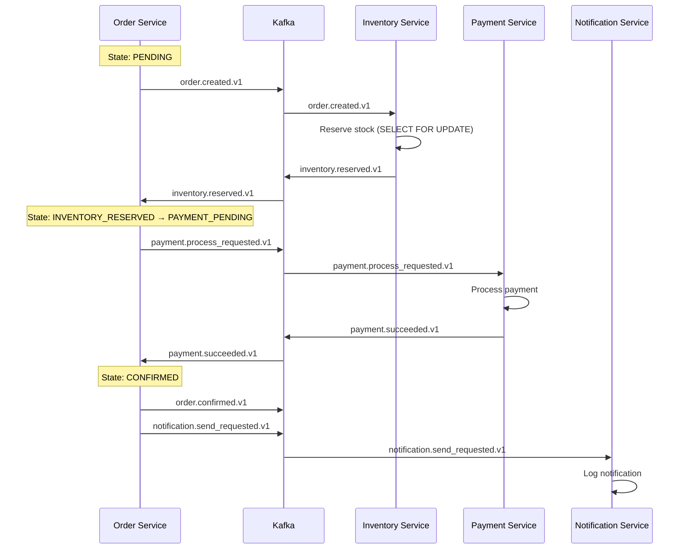
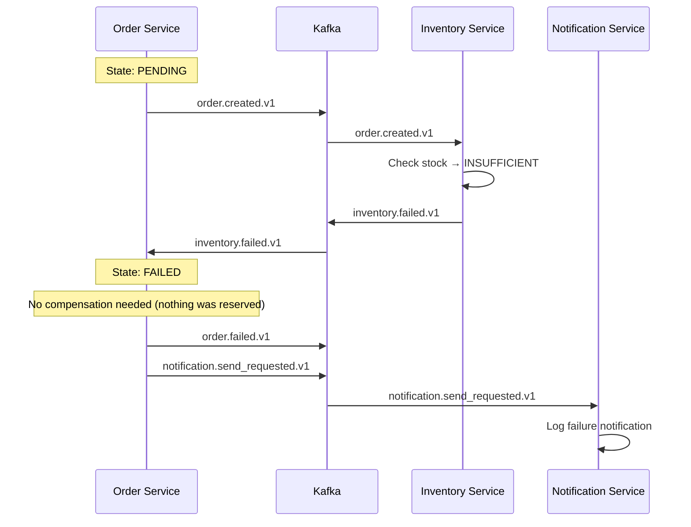
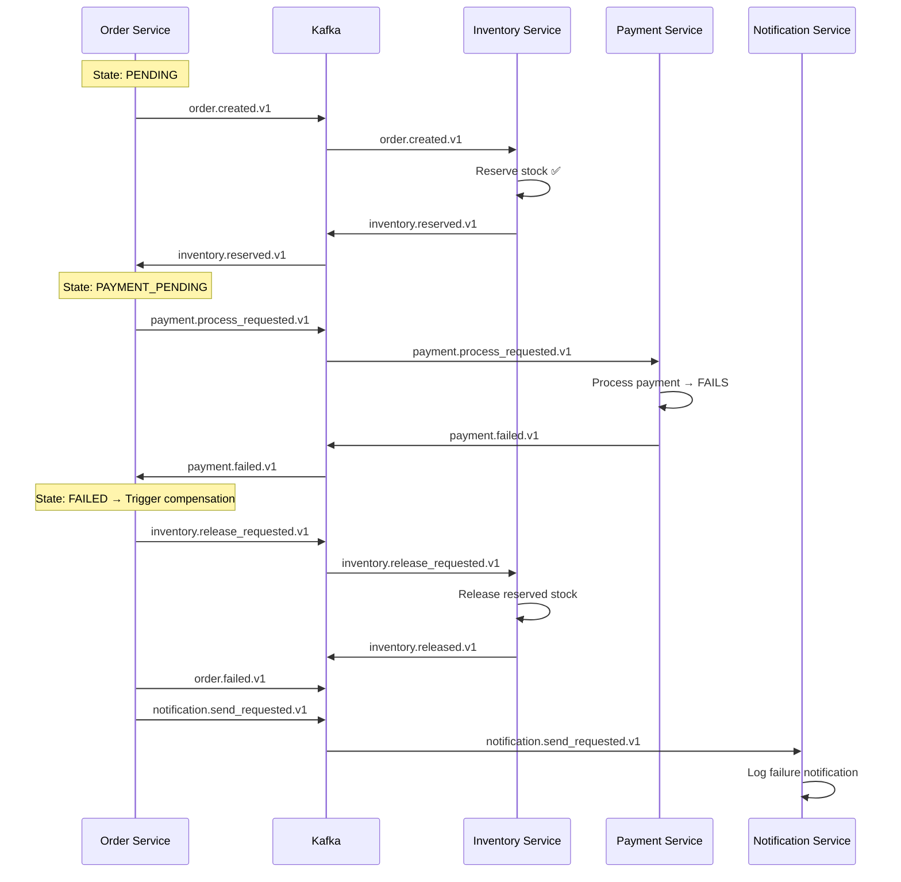
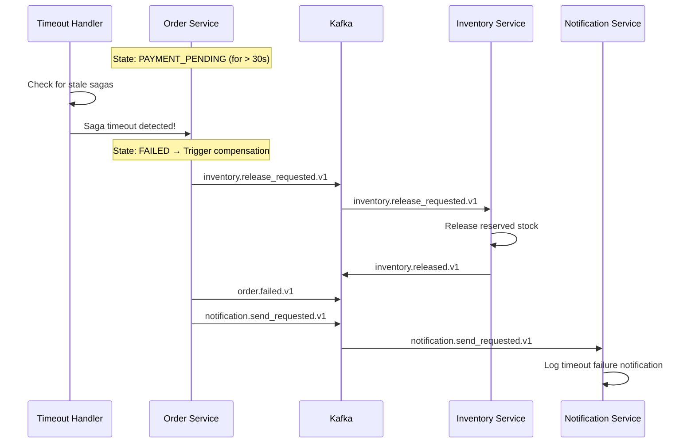
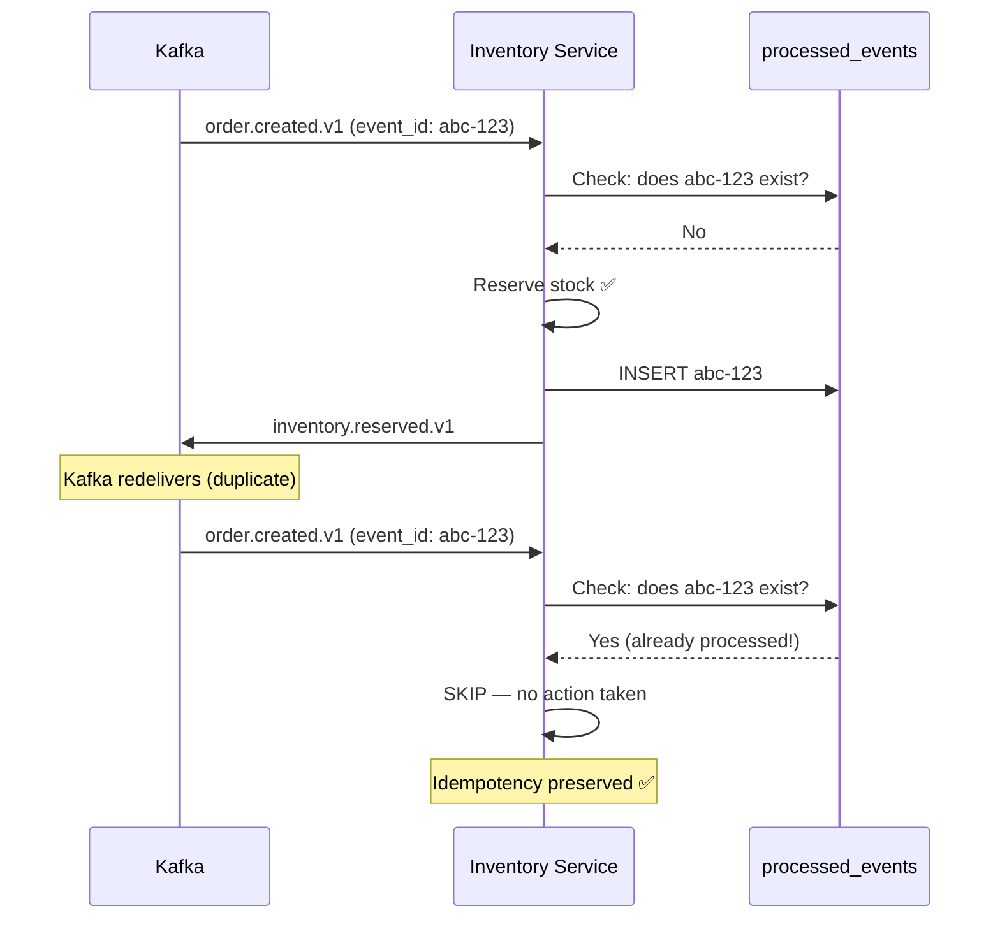

# Eventify — Saga Flows

## Saga Overview

The Order Service acts as the **Saga Orchestrator**. It coordinates the distributed workflow using a state machine. Each step produces events via the **Transactional Outbox** pattern, and reactions from other services drive state transitions.

---

## Saga State Machine



### State Descriptions

| State | Meaning | Next Action |
|-------|---------|-------------|
| `PENDING` | Order created, waiting for inventory | Inventory Service will reserve stock |
| `INVENTORY_RESERVED` | Stock reserved, requesting payment | Payment request sent via outbox |
| `PAYMENT_PENDING` | Waiting for payment result | Payment Service will process |
| `CONFIRMED` | Payment succeeded, order complete | Notification sent |
| `FAILED` | Something failed, compensations triggered | Inventory released (if reserved) |

---

## Flow 1: Happy Path ✅

Everything succeeds.



---

## Flow 2: Inventory Failure ❌

Product out of stock.



---

## Flow 3: Payment Failure ❌ (Compensation Required)

Inventory reserved but payment fails → must release inventory.



---

## Flow 4: Payment Timeout ⏰ (Compensation Required)

Payment service doesn't respond within SLA (e.g., 30 seconds).



---

## Flow 5: Duplicate Event Handling 🔁

Same event delivered twice (at-least-once delivery).



---

## Compensation Summary

| Failure Point | What Was Done | Compensation Action |
|--------------|---------------|-------------------|
| Inventory fails | Nothing | None needed |
| Payment fails | Inventory reserved | Release inventory |
| Payment timeout | Inventory reserved | Release inventory |
| Notification fails | Order confirmed | Retry (no compensation) |

---

## Key Implementation Details

### 1. Atomic State Transitions
Every saga state change happens in the same DB transaction as the outbox event write:
```
BEGIN TRANSACTION
  UPDATE saga_state SET current_step = 'PAYMENT_PENDING'
  INSERT INTO outbox_events (payment.process_requested.v1)
COMMIT
```

### 2. Timeout Detection
A background job runs every 10 seconds, querying:
```sql
SELECT * FROM saga_state 
WHERE current_step = 'PAYMENT_PENDING' 
AND timeout_at < NOW()
AND status = 'ACTIVE'
```

### 3. Outbox Worker
Polls every 1 second:
```sql
SELECT * FROM outbox_events 
WHERE status = 'PENDING' 
ORDER BY created_at 
LIMIT 10
```
Publishes to Kafka, then marks as `SENT`.
